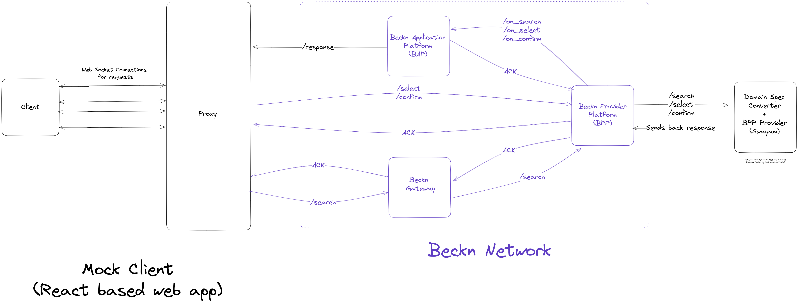

# Decentralised Skilling and Education Protocol: Trainings and Courses

This doc underlines the architectural implementational details of reference **Beckn Provider Platform (BPP)** implementation for the **Courses and Training** track complaint to **DSEP spec v1.0.0.**

### Deployment and Network Registration Details

The reference BPP implemented in this repository is onboarded on the `Beckn Gateway` and `Beckn Gateway Registry` under the `Courses and Trainings` category.

- [**BPP Deployed URL**](https://bpp.dsep.samagra.io)
- [**BAP Deployed URL**](https://bap.dsep.samagra.io)
- **BPP Network Participant Id**: bpp.dsep.samagra.io
- [Network Participant Information on Beckn Registry](https://registry.becknprotocol.io/network_participants/index/network_participants/show/430)

## Tech Stack

**Programming Language**: TypeScript
**Framework**: NestJS
**Database**: Postgres exposed via Hasura
**Runtime**: Node v16.19.0

## Project Organisation

This reference implementation contains all three network participants, i.e. **Beckn Provider Platform**, **Beckn Gateway**, **Beckn Provider Platform**, organised as a **NestJS Monorepo**.

### Directory structure

```bash
.
├── apps
│   ├── bap
│   ├── bg
│   └── bpp
├── docs
│   └── examples
├── tsconfig.build.json
├── tsconfig.json
├── types
│   └── schema.ts
├── utils
│   ├── generators.ts
│   ├── types.ts
│   └── utils.ts
├── nest-cli.json
├── package.json
├── README.md
└── yarn.lock
```

The `apps` directory contains the actual apps for each network participant
`apps/bap` and `apps/bg` contains the code for a sample `Beckn Application Platform` and `Beckn Gateway` respectively for testing the `Beckn Provider Platform`.

More details about each network participant and their implementation can be found their following directories here as:

- [Beckn Application Platform (BAP)](https://github.com/Samagra-Development/dsep/blob/master/apps/bap/README.md)
- [Beckn Gateway(BG)](https://github.com/Samagra-Development/dsep/blob/master/apps/bg/README.md)
- [Beckn Provider Platform (BPP)](https://github.com/Samagra-Development/dsep/blob/master/apps/bpp/README.md)

## Architecture



## Features & User workflow

The reference app is a **Course Discovery Platform** that talks in **Decentralised Skilling and Education Protocol** and curates courses from various providers like, **Swayam Portal**, **MIT OCW**, **Udemy**, etc., right now only swayam is onboarded as a provider, other platforms can be easily onboarded onto the BPP.

The `/search` request is forwarded to the `Beckn Gateway` with the domain of `dsep:courses` so that reaches our reference `BPP`. The `BPP` then forwards the `search` request to the `Swayam Provider Wrapper` which translates the `Beckn` compliant search request into a search query compatible to be forwarded to the `Swayam Portal` and fetches the result from there. The fetched results are then again converted in `Beckn /on_search` compliant response and forwarded to the `BPP`, which then calls the `/on_back` endpoint on the `bap_uri` present in the search requests's `context`. The sample `BAP` implementation for the demonstration of end to end flow right now, forwards the request to the `client proxy` which determines which client the request belongs to based on the `message_id` and `transaction_id` in the context of the `on_search` request and forwards the response to the concerned client.
The `client` and `client proxy` are connected together via a websocket connection using `redis` and `socket.io` to create a `publish-subscribe` model to support the **asynchronous nature** of `Beckn APIs`. (To learn more about the Beckn APIs and their structure refer the [official Beckn Protocol Website](https://https://becknprotocol.io/))

### Supported Methods

**/search:** This method/endpoint allows for searching of courses and training via a direct DSEP complaint request to the BPP using the context.domain as `dsep:courses`

**/select**: This method/endpoint is allows for selecting some courses or trainings to be enrolled in/purchased by the user. The context domain for this method should be `dsep:courses`.  In the reference course discovery platform implementation this endpoint is called when expanding a particular course to view its details.

**/init**: This method/endpoint is allows for initiating purchasing a course or training by getting a quote from the provider and entering personal details required for enrollment. The context domain for this method should be `dsep:courses`.

**/confirm**: This method/endpoint indicated the confirmation of an order after successful payment/enrollment. In the reference course discovery platform implementation this endpoint is called when visiting the course on the external website.

## Local installation

Follow the following steps to setup the monorepo locally on your system.

1. Clone the repository

    ```bash
    git clone https://github.com/Samagra-Development/dsep
    ```

2. Navigate into the directory where you have cloned the repository

```bash
cd /path/to/cloned/repository
```

3. Install the required dependencies using the package manager of your choice (yarn preferred).

    ```bash
    yarn install
    ```

4. Create a `.env` file similar to the `.env,sample` file and populate it with required credentials
5. [Install Docker](https://docs.docker.com/engine/install/), [Install Docker Compose](https://docs.docker.com/compose/install/linux/), and run

    ```bash
    docker compose up
    ```

6. Navigate to your hasura UI which will be started after running the command in `Step 5` and create a table named `dsep_courses`.
7. Run the services for the required network participant using the following commands

    ```bash
    yarn start <bap | bg | bpp> # replace <bap | bg | bpp> with a single name
    # for example: yarn start bpp will start the BPP
    ```

Or start all of them together using
    ```bash
    yarn start:all # this will start all the services
    ```

## Deployment

1. [Install Docker](https://docs.docker.com/engine/install/), [Install Docker Compose](https://docs.docker.com/compose/install/linux/), and run

    ```bash
    docker compose up
    ```

2. PM2 Based Deployment

    ```bash
    yarn build
    pm2 start dist/apps/bpp/main.js --name beckn-bpp
    pm2 start dist/apps/bap/main.js --name beckn-bap
    pm2 start dist/apps/bg/main.js --name beckn-bg
    ```

## Related Repositories

- [Mock Provider (Swayam)](https://github.com/Samagra-Development/swayam-wrapper)
- [BAP Client Proxy](https://github.com/Samagra-Development/dsep-ui/tree/master/apps/client-proxy) - Acts as a service connecting Client and Proxy
- [BAP Client](https://github.com/Samagra-Development/dsep-ui) - A course search page

## Adding Services to Beckn Registry

Follow [this guide](https://github.com/sanjay95/BECKN-Integration-to-Gateway/blob/main/README.md) to onboard yourself on the Beckn Registry.

## Resources to know more about DSEP and Beckn

- [Beckn Official Website](https://becknprotocol.io)
- [Core DSEP Specification](https://github.com/beckn/protocol-server/blob/v2/schemas/core.yaml)

## Stay in touch

- Author: [Yash Mittal](https://github.com/techsavvyash)
- Mentor on the project: [Chakshu Gautam](https://github.com/ChakshuGautam)
